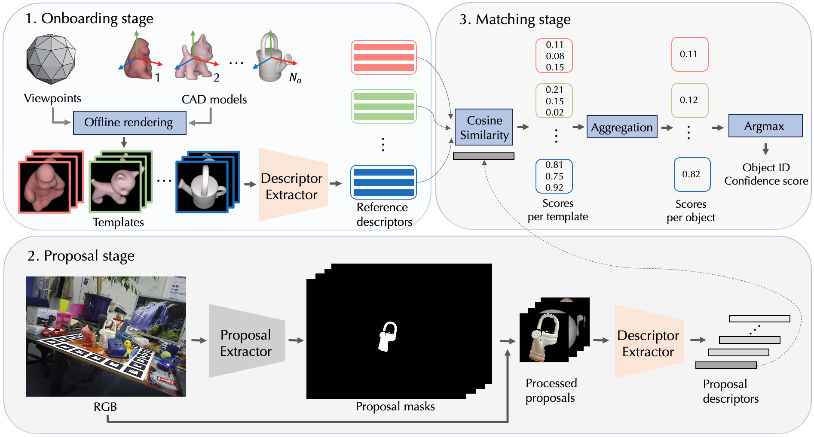
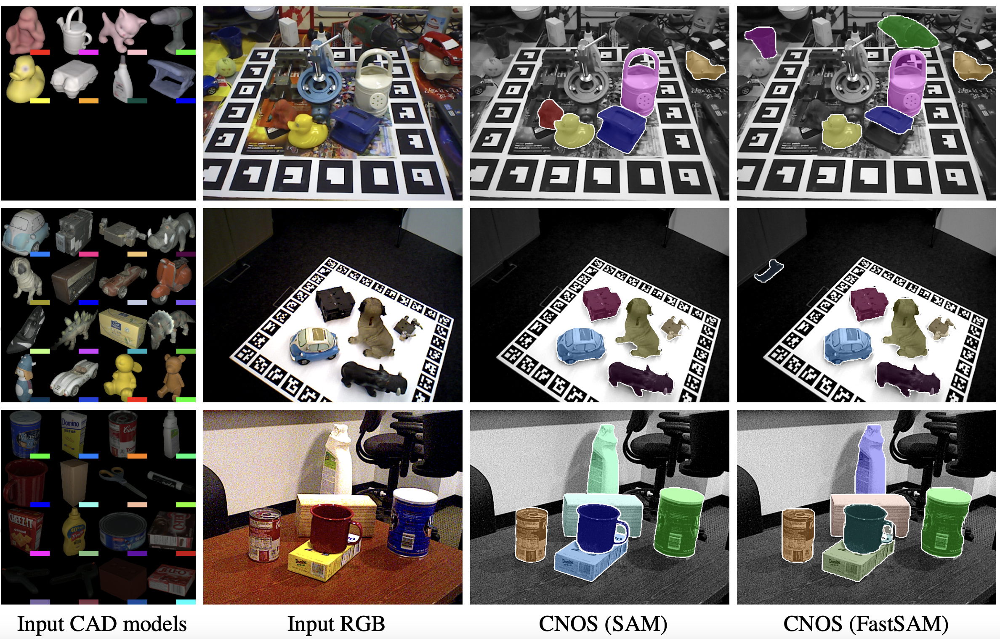
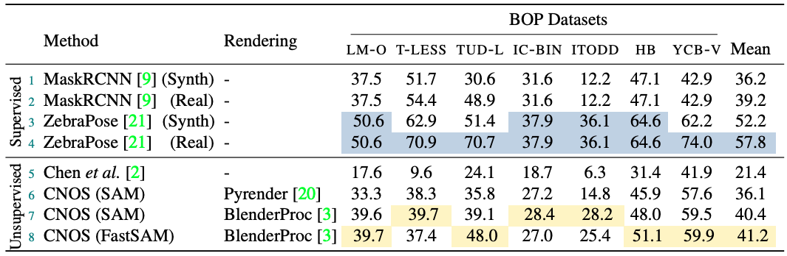
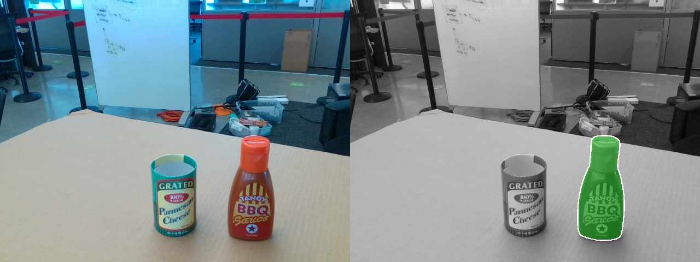
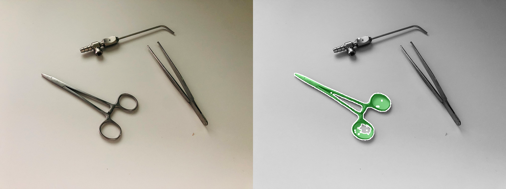

<div align="center">
<h2>
CNOS: A Strong Baseline for CAD-based Novel Object Segmentation
</h2>

<h3>
<a href="https://nv-nguyen.github.io/" target="_blank"><nobr>Van Nguyen Nguyen</nobr></a> &emsp;
<a href="http://imagine.enpc.fr/~groueixt/" target="_blank"><nobr>Thibault Groueix</nobr></a> &emsp;

<a href="https://ponimatkin.github.io/" target="_blank"><nobr>Georgy Ponimatkin</nobr></a> &emsp;
<a href="https://vincentlepetit.github.io/" target="_blank"><nobr>Vincent Lepetit</nobr></a> &emsp;
<a href="https://cmp.felk.cvut.cz/~hodanto2/" target="_blank"><nobr>Tomáš Hodaň</nobr></a> &emsp; <br>
<p></p>

<a href="https://nv-nguyen.github.io/cnos/"></a>
<a href="http://arxiv.org/abs/2307.11067"></a>
<p></p>




</h3>
</div>

CNOS is a simple three-stage approach for CAD-based novel object segmentation. It is based on [Segmenting Anything](https://github.com/facebookresearch/segment-anything), [DINOv2](https://github.com/facebookresearch/dinov2) and can be used for any objects without retraining. CNOS outperforms the supervised MaskRCNN (in CosyPose) which was trained on target objects. CNOS has been used as the baseline for [Task 5](https://bop.felk.cvut.cz/leaderboards/detection-unseen-bop23/core-datasets/) and [Task 6](https://bop.felk.cvut.cz/leaderboards/segmentation-unseen-bop23/core-datasets/) in [BOP challenge 2023](https://bop.felk.cvut.cz/challenges/bop-challenge-2023/)!



Here are some qualitative results of CNOS on the YCBV dataset. We are displaying only detections with a confidence score greater than 0.5 for better visibility.

If our project is helpful for your research, please consider citing : 
```latex
@inproceedings{nguyen2023cnos,
title={CNOS: A Strong Baseline for CAD-based Novel Object Segmentation},
author={Nguyen, Van Nguyen and Groueix, Thibault and Ponimatkin, Georgy and Lepetit, Vincent and Hodan, Tomas},
booktitle={Proceedings of the IEEE/CVF International Conference on Computer Vision},
pages={2134--2140},
year={2023}
}
```
You can also put a star :star:, if the code is useful to you.

If you like this project, check out related works from our group:
- [GigaPose: Fast and Robust Novel Object Pose Estimation via One Correspondence (CVPR 2024)](https://github.com/nv-nguyen/gigaPose)
- [NOPE: Novel Object Pose Estimation from a Single Image (CVPR 2024)](https://github.com/nv-nguyen/nope)
- [Templates for 3D Object Pose Estimation Revisited: Generalization to New objects and Robustness to Occlusions (CVPR 2022)](https://github.com/nv-nguyen/template-pose) 
- [PIZZA: A Powerful Image-only Zero-Shot Zero-CAD Approach to 6DoF Tracking (3DV 2022)](https://github.com/nv-nguyen/pizza)
- [BOP visualization toolkit](https://github.com/nv-nguyen/bop_viz_kit)

## Updates:
- 23/05/2024: Added [tutorial](https://github.com/nv-nguyen/cnos?tab=readme-ov-file#testing-on-bop-datasets-rocket) to run CNOS on [HOPE dataset](https://bop.felk.cvut.cz/datasets/) for [BOP challenge 2024](https://bop.felk.cvut.cz/challenges/bop-challenge-2024/).
- 23/07/2023: Added [tutorial](https://github.com/nv-nguyen/cnos#testing-on-custom-datasets-rocket) to run CNOS on custom datasets

## Installation :construction_worker:

<details><summary>Click to expand</summary>

Please make sure that you update this [user's configuration](https://github.com/nv-nguyen/cnos/blob/main/configs/user/default.yaml) before conducting any experiments. 

### 1. Create conda environment
```
conda env create -f environment.yml
conda activate cnos

# for using SAM
pip install git+https://github.com/facebookresearch/segment-anything.git

# for using fastSAM
pip install ultralytics==8.0.135
```

### 2. Datasets and model weights

#### 2.1. Download datasets from [BOP challenge](https://bop.felk.cvut.cz/datasets/):

For [BOP challenge 2024](https://bop.felk.cvut.cz/challenges/bop-challenge-2024/) core datasets (HOPE, HANDAL, HOT-3D), download each dataset with the following command:
```
pip install -U "huggingface_hub[cli]"
export DATASET_NAME=hope
python -m src.scripts.download_bop24 dataset_name=$DATASET_NAME
```

For [BOP challenge 2023](https://bop.felk.cvut.cz/challenges/bop-challenge-2023/) core datasets (LMO, TLESS, TUDL, ICBIN, ITODD, HB, and TLESS), download all datasets with the following command:
```
python -m src.scripts.download_bop23
```

#### 2.2. Rendering templates with [Pyrender](https://github.com/mmatl/pyrender):
Note: This rendering is fast. For example, using a single V100 GPU, it can be done within 10 minutes for seven core datasets of BOP'23. 

For [BOP challenge 2024](https://bop.felk.cvut.cz/challenges/bop-challenge-2024/) core datasets (HOPE, HANDAL, HOT-3D), rendering templates with Pyrender is only required for model-based tasks, while for model-free tasks, you can skip this step since the images in onboarding videos can be used directly. To render templates for model-based tasks:
```
export DATASET_NAME=hope
python -m src.scripts.render_template_with_pyrender dataset_name=$DATASET_NAME
```
For [BOP challenge 2023](https://bop.felk.cvut.cz/challenges/bop-challenge-2023/) core datasets (LMO, TLESS, TUDL, ICBIN, ITODD, HB, and TLESS), you can use the pre-rendered templates at [this Google Drive link (4.64GB)](https://drive.google.com/file/d/1yz2-q74PGws1OtDalX3ySo7AhiwWveK1/view?usp=sharing) and unzip it into $ROOT_DIR or render template from scratch with:
```
python -m src.scripts.render_template_with_pyrender
```

#### 2.3. Download model weights of [Segmenting Anything](https://github.com/facebookresearch/segment-anything):
```
python -m src.scripts.download_sam
```

#### 2.4. Download model weights of [Fast Segmenting Anything](https://github.com/CASIA-IVA-Lab/FastSAM):
```
python -m src.scripts.download_fastsam
```

#### 2.5. Download [BlenderProc4BOP](https://bop.felk.cvut.cz/datasets/) set:
This is only required when you want to use realistic rendering with BlenderProc.


For [BOP challenge 2024](https://bop.felk.cvut.cz/challenges/bop-challenge-2024/) core datasets (HOPE, HANDAL, HOT-3D):
```
pip install -U "huggingface_hub[cli]"
export DATASET_NAME=hope
python -m src.scripts.download_train_pbr_bop24 dataset_name=$DATASET_NAME
```
For [BOP challenge 2023](https://bop.felk.cvut.cz/challenges/bop-challenge-2023/) core datasets (LMO, TLESS, TUDL, ICBIN, ITODD, HB, and TLESS):
```
python -m src.scripts.download_train_pbr_bop23
```


</details>

##  Testing on [BOP datasets](https://bop.felk.cvut.cz/datasets/) :rocket:

We provide CNOS's predictions for three core dataset of [BOP challenge 2024](https://bop.felk.cvut.cz/challenges/bop-challenge-2024/) with SAM model and seven core dataset of [BOP challenge 2023](https://bop.felk.cvut.cz/challenges/bop-challenge-2023/) with both SAM and FastSAM models in [this link](https://drive.google.com/drive/folders/1yGRKpz1RI4h5-u0drusVeXPuAsg_GIO5?usp=sharing).

<details><summary>Click to expand</summary>

1. Run CNOS to get predictions:

```
export DATASET_NAME=lmo 
# adding CUDA_VISIBLE_DEVICES=$GPU_IDS if you want to use a specific GPU

# with FastSAM + PBR
python run_inference.py dataset_name=$DATASET_NAME model=cnos_fast

# with FastSAM + PBR + denser viewpoints
python run_inference.py dataset_name=$DATASET_NAME model=cnos_fast model.onboarding_config.level_templates=1

# with FastSAM + PyRender
python run_inference.py dataset_name=$DATASET_NAME model=cnos_fast model.onboarding_config.rendering_type=pyrender

# with SAM + PyRender
python run_inference.py dataset_name=$DATASET_NAME model.onboarding_config.rendering_type=pyrender

# with SAM + PBR
python run_inference.py dataset_name=$DATASET_NAME

# using smaller models for FastSAM and DINOv2
python run_inference.py dataset_name=$DATASET_NAME model=cnos_fast model.descriptor_model.model_name=dinov2_vits14 model.segmentor_model.checkpoint_path=

```
After running this script, CNOS will output a prediction file at [this dir](https://github.com/nv-nguyen/cnos/blob/main/configs/run_inference.yaml#L9). You can then evaluate this prediction on [BOP challenge website](https://bop.felk.cvut.cz/).

2. Visualize the predictions:

There are two options:

2.a. Using our custom visualization without Detectron2 (display only masks)

```
python -m src.scripts.visualize dataset_name=$DATASET_NAME input_file=$INPUT_FILE output_dir=$OUTPUT_DIR
```

2.b. Using Detectron2 (display both masks, objectID, scores)
```
python -m pip install 'git+https://github.com/facebookresearch/detectron2.git'
python -m src.scripts.visualize_detectron2 dataset_name=$DATASET_NAME input_file=$INPUT_FILE output_dir=$OUTPUT_DIR

```

</details>

##  Testing on custom datasets :rocket:

You can run CNOS on your custom dataset given a RGB image and the CAD model of the target object. We provide an example of running CNOS on "BBQ sauce" sample taken from [MegaPose](https://github.com/megapose6d/megapose6d).



<details><summary>Click to expand</summary>

There are two steps to test CNOS on your own dataset:

0. Define the path to your dataset:
```
export CAD_PATH=./media/demo/hope_000002.ply
export RGB_PATH=./media/demo/bba_sauce_rgb.png
export OUTPUT_DIR=./tmp/custom_dataset
```

1. Render the template from CAD models:
```
bash ./src/scripts/render_custom.sh
```
If the quality of rendering is not good, you can try to ajust the lightning conditions and distance between the camera and the object in [this script](https://github.com/nv-nguyen/cnos/tree/main/src/scripts/render_custom.sh).

2. Run CNOS and visualize the results:
```
bash ./src/scripts/run_inference_custom.sh
```
The detections will be saved at $OUTPUT_DIR/cnos_results. This script is used by default for single-CAD object segmentation. If you want to segment multiple objects, please make few adaptations [this script](https://github.com/nv-nguyen/cnos/tree/main/src/scripts/inference_custom.py).

</details>

Tricks and tips to improve results when running on custom objects with the sample taken from [jakob-ropers-snkeos](https://github.com/jakob-ropers-snkeos).



<details><summary>Click to expand</summary>


Please note that SAM or FastSAM can perform exceptionally well, even on very small objects. However, certain parameters from the original implementation require adjustments to achieve optimal results. For example, it is recommended to reduce the default stability_score_thresh value of 0.97 to smaller settings, like 0.5 (applied after step 1 of rendering).
```
python -m src.scripts.inference_custom --template_dir $OUTPUT_DIR --rgb_path $RGB_PATH --stability_score_thresh 0.5
```
</details>

## Acknowledgement

The code is adapted from [Nope](https://github.com/nv-nguyen/nope), [Segmenting Anything](https://github.com/facebookresearch/segment-anything), [DINOv2](https://github.com/facebookresearch/dinov2). 

## Contact
If you have any question, feel free to create an issue or contact the first author at van-nguyen.nguyen@enpc.fr